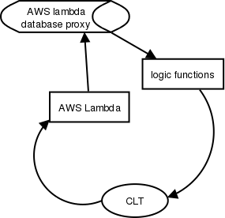

# Rust project 1
This is a Rust based calculting tools to return the maximum length of palindrome string of the user input

# Lambda Logic 

# Building and Running

* build: cd into dietrecord and run `make all`/
* run: this project has already deployed to aws lambda, so please run the function `make invoke` to see the result
* example result: the input under `--data-ascii '{"name":"abcbadad"}`, and the output should be: "abcbadad longest palindrome is abcba"

## References

* [aws lambda](https://docs.aws.amazon.com/lambda/latest/dg/welcome.html)
* [5. Longest Palindromic Substring](https://leetcode.com/problems/longest-palindromic-substring/)
